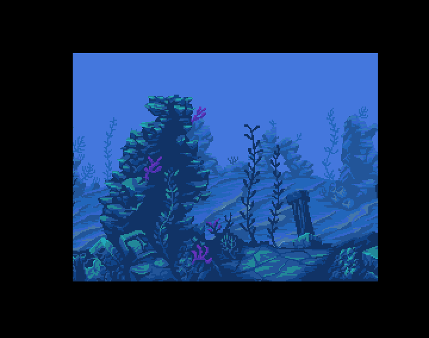

## Dual Playfield

A simple dual playfield scrolling.
The (beautiful) graphics are drawn by Ansimuz. The other works of this artist can be found here : https://ansimuz.itch.io/.
Thanks to him.

### Amos screens 

Amos introduces the concept of "screens". We can define up to 8 screens displayed at the same time with variable resolutions and color depths.
The screens cannot be overlapped except in the particular case of the dual playfield mode of the Amiga which allows to overlap two screens with up to 8 colors each (the color 0 of the foreground screen is transparent).

The code shows that you can simply define two screens in dual playfield in Amos.

### Scrolling

The two horizontal scrollings in the demo are based on the repetition of the same image.
The background field is an image of 512 pixels wide. The first left half of this 256 pixel wide image is identical to the second right half.
Thus the image scrolls to 256 pixels and when this position is reached, the screen offset is reduced to zero. As both parts of the image are identical it is invisible to the viewer.
This allows the image to be scrolled again by 256 pixels and so on. So we simply get a repetitive but infinite scrolling.
The same technique is used on the first 758 pixel wide screen.

### bitplanes

An image rendered on the Amiga is composed of bitplanes.
Each pixel of an image is associated with as many bits as there are bitplanes defined.
For example, an image of four colors corresponds to two bitplanes, i.e. two bits per pixel. 
There are thus 4 possible values for a pixel: 00, 10, 01 or 11 that is to say in decimal 0, 1, 2 or 3 corresponding to the index of a color in the palette.

The Amiga OCS and ECS have six bitplanes that is a maximum of two powers of six that is 64 colors. 
The dual playfield mode of the demo is built with two overlapping screens of 8 colors, i.e. three bitplanes each.

The dual playfield mode is used in a lot of demo and games.
