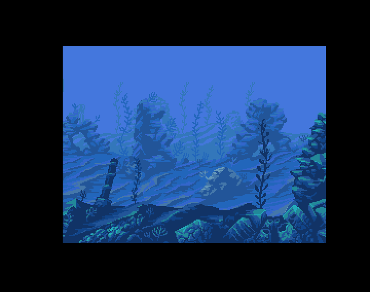

## Three Playfields

This short code demonstrates a simple three playfields (three depths of field). 
Two fields scroll and the farthest plane is fixed and undulates sinusoidally.
The (beautiful) graphics are drawn by Ansimuz. The other works of this artist can be found here : https://ansimuz.itch.io/.
Thanks to him.

### Screens and scrolling 

There is an example in the repository showing a dual playfied scrolling on which this code is based: amiga_coding_in_amos/snippet-003_simpleDualPlayfield/ 

### How it works

At the beginning of the code a simple mono color image is deformed horizontally in a sinusoidal way into 16 images saved as a bob bank.
The trick of a third field is done by using a mono color bob in the second screen (the back playfield). 

In the case of the example, the chosen bitplane for the bob is the third one.
An instuction "set bob" is used to display only the bob in the third bitplane (the other bitplanes are not affected). 
It is done with the third parameter "%100" of "set bob".  
The second parameter "0" (default value) means that the original graphics are restored at each move of the bob. 

The part of the scenery where the bob is located has some specific colors : only colors with indexes 3,4,5,6 and 7. 
So as pixels of the bob that are not transparent have the last third bit set, the pixels of the scenery with the colors 4,5,6 or 7 are unchanged when the bob
is applied to them because they have already the 3rd bit to 1. It gives the illusion that the bob remains behind the scenery. 

When the color of the scenery is 3 (the quite dark blue color, so no scenery), it becomes the color with index 7 because the third bit is set to 1 (3 = %110, 7 = %111). 
This is the colour of the sinusoidal visible part of the bob that appears.     

The first time I saw this trick in Amos is in a code published by Bitbeamcanon (https://bitbeamcannon.com/). Thanks Mike !
