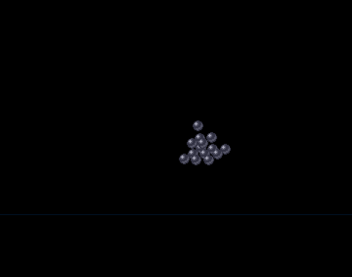

## Vector balls

This short code demonstrates a simple (smooth and realtime) vector balls scene using the Amos language
A pyramid of 14 balls rotates on itself and moves on the Y axis. When it touches the ground, it crashes and then rises again.

This scene is inspired by one of the scenes of the famous and extraordinary demo Hardwired / Silents - Crionics 1991.
The ball, a 16x16 bob in 4 colors comes from this demo.

### Screen

A simple screen of 320x256 in 4 colors is opened in double buffer.
The ball is a bob of 16x16 grabbed from an IFF image in the asset folder.

### How it works

The 14 3D points of the pyramid are simply rotated and projected on the xe,ye 2d coordinates.
To gain some speed, a trick is used : the 3d z coordinates are kept in an array. Then "sort" instruction of Amos is used to quick sort the Z allowing to display the balls in the accurate order (the farthest first).
To keep a link between the index of a ball and its z coordinates, the index is add to the z value after have multipling this value by 16 in order that the addition of the index not to influe the sort.
A sort algo can be implemented in Amos but it will be slower.

We can change the value of cz to increase the size of the pyramid on the screen.

The same vector balls algo has been used in our demo : New Impact https://www.pouet.net/prod.php?which=88383

### It can be optimized (of course !)

As it is, the 14 balls turn and move in real time at 25 fps on a standard vanilla A500.
Not too bad but obviously we can do better (keeping the real time): either have 50 fps for example or increase the number of balls.
To do this, we could remove as much as possible the arrays in Amos which are quite slow (even with a single entry) and use the x,y,z values directly.
It is also possible to reduce the clearing area to the surface of the pyramid by using variants of the blitter clear instruction.

