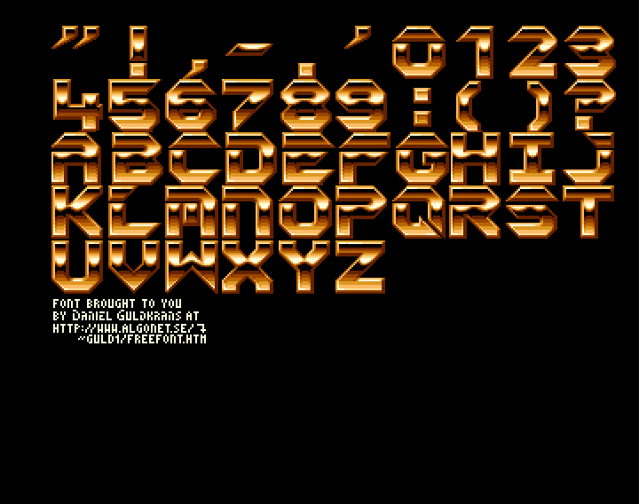
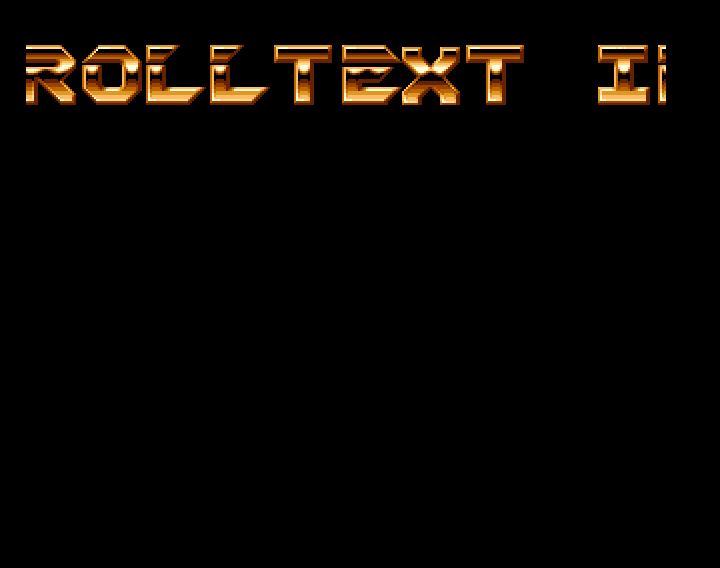
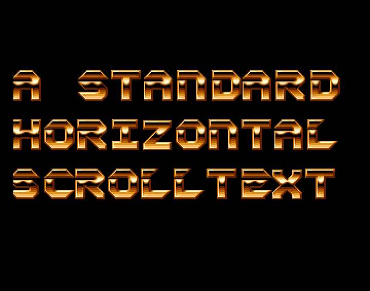

## Horizontal scrolling text

The three short codes demonstrate an horizontal scrolling text scene using the Amos language. A classic.

- displayFont.amo(s) shows how to display a font from an iff image contaning all the letters.
- horizontalScrollText.amo(s) is a simple horizontal scroll text scene. It is the main source of this snippet.
- multiScroll.amo(s) is derived from horizontalScrollText.amo(s) and shows a multi scroll texts scene.

### Displaying a font

The idea is to define the displayable alphabet in a string called here ALPHA$.
The position of each letter in this string matches the index of an image (bob, icons etc).

In the example an IFF image contains all the letters which are grabbed following the same order than in ALPHA$.
When a text is to be displayed, for example "AMIGA", each letter of the "AMIGA" is considered : for example when the letter M is to 
be displayed (i.e. the 2nd letter of the word "AMIGA"), as "M" is at the 33rd position in the alphabet, the icon 33 is then displayed (it is an M of course).

The font seems to come from the demoscene and was posted on the Web by Daniel Guldkrans.  

### Hozizontal scoll text

Here is the principle of idea of the infinite scoll text:

Let's suppose that the text is : ABCDEFGHIJK, knowing that we can only display 4 letters take the whole visible size. If the visible size is 320 pixels, we assume that we have a screen of 320x2=640 pixels
[----]---- : So 8 dashes for 640 pixels. Between brackets, the visible area.

At the beginning the visible screen is initialized with ABCD:
[ABCD]----

The next element of the text is displayed just before scrolling, so E and the screen scrolls. But E is displayed on the right but also on the left of the visible edge (so invisible for the moment).
We obtain:
E[BCDE]---

E replaced A but the "player" did not see it because it is on the invisible part.

Then we continue with the F, then G, then H and each time we copy on the right and on the left:
EF[CDEF]--
EFG[DEFG]-
EFGH[EFGH]

So at this point we scrolled to the end of the possible area. We could think that we are stuck because the right edge reaches 640 pixels.
But since we were smart and built the same screen on the left side, we can go back directly to the left part (Screen offset at zero) and the viewer will see nothing:
[EFGH]EFGH
And we can continue with IJK etc
I[FGHI]FGH
IJ[GHIJ]GH etc...

So this an infinite horizontal scroll in Amos. As only the display pointer is used with screen offset and only a small piece of text is copied at each iteration, the scroll is smooth.
In fact we have to add small strips on the right and on the left of the visible window in order not to see the icons displayed during the completion of the scenery and we have to manage the display by icon according to the speed and the direction of the scroll but
the principle is the one described.

### Multi scrolls

The previous idea is applied to 3 screens that display a scroll text with 3 different speeds. 

