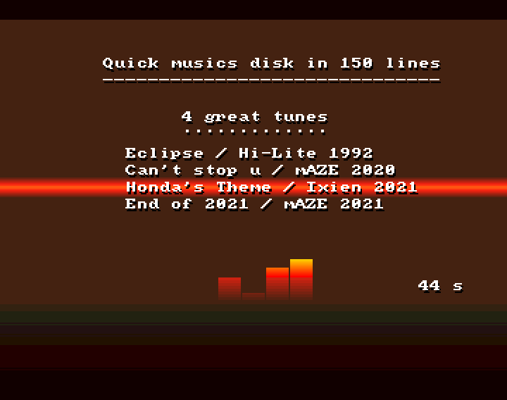

## Music and Amos

Playing music in Amos, and therefore generally a sound/noise/protracker module, has always been problematic.

In the first version of Amos, we had to convert the modules, which massacred the music.
Amos pro added the native protracker format with the instructions suffixed with "Track". It's a little better than the conversion but the rendering is often bad.

Fortunately some extensions have provided instructions to improve this. Amos Community contains the AMCAF extension which allows to read modules and to ease the relationship between programmer and musician...
It's not perfect yet. Writing a specific AMOS music extension for any Amiga for a perfect reading is still of interest today.

### How to play a module.
Loading a music uses the classic "Track Load" instruction. The instuction "Pt play" allows to play the music, the instuction "Pt Stop" to stop it.
To adjust the volume, "Pt volume" allows to specify a value between 0 (no sound) and 64 (100% volume).

Here is an example:
```
' Loading a mod in bank number 10 and play it
Track Load "assets/eclipse.mod",10
Pt Play 10

Wait Key 

For I=64 To 0 Step -1
   Pt Volume I
   Wait Vbl 
Next 

' Stop and clean memory
Pt Stop 
Erase 10
Pt Volume 64 : Rem volume reset to default value
```

### A small music disk
To illustrate the basic commands of music playback, the proposed source is a small music disk.
The writing was quite fast. It is unpretentious but it is a good example of the simplicity and the productivity of the AMOS language.



The music disk allows to listen to four musics used in our last demos (https://demozoo.org/groups/111822/). So thanks to Hi-Lite, mAZE and Ixien for their great works.
The musics follow each other naturally or you can go directly to the next one with the left button of the mouse.
The time of each music (in seconds) is displayed in the bottom right part of the screen. It is calculated with the Timer function that was already used in the first snippet to display the number of FPS.

The program also contains a simple text display based on the use of a system font (so different from the snippet-006_horizontalScrollText algo), a quick coded vumeter composed of 4 animated bobs in AMAL and several rasters (with the poetic name of "rainbow" in amos) to colorize the screen a bit.

