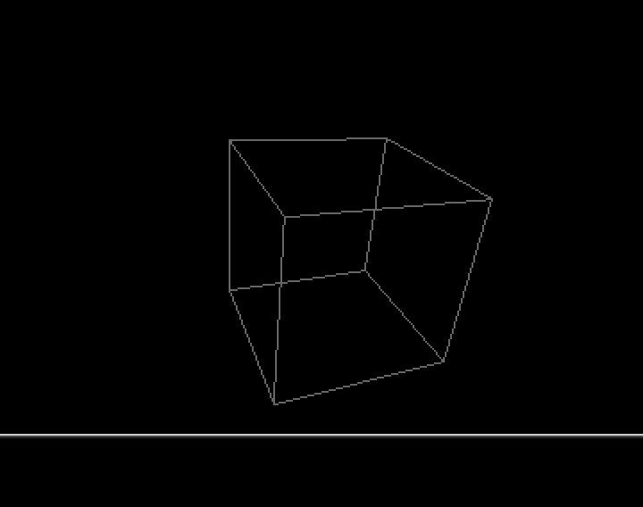

## A simple rotating 3D cube

Some previous snippets are relative to 3D (001 and 005) but the 3D wire cube is such a classic then here it is.



### How it works

A one bitplane screen is open. To add some colors, a small raster is set at the bottom of the screen. 

The cube is made of 8 points (x,y,z coords) :
```
Data -1,-1,-1
Data 1,-1,-1
Data 1,1,-1
Data -1,1,-1
Data -1,-1,1
Data 1,-1,1
Data 1,1,1
Data -1,1,1
```

At each vbl, each point is rotated along x, y and z axis with different angles (AX, AY and AZ) and then each point is projected into the 2D plan of the screen.

A cube is made of 12 segments which are drawn with the "Turbo Draw" instruction. This one is brought by the Amcaf extension included in the Amos distribution used for these snippets (link in the main page of this repository).
"Turbo Draw" is a bit faster than the usual "Draw" on standard A500. Moreover this instruciton allows to specify the ink index, the bitplanes and can be used to fill surfaces with the blitter (which is not used here).


### It can be optimized (of course !)

After compilation, this very simple cube rotates at 50 fps of course.
So I don't need to optimize it.

However to include it in a more sophisticated scene, a lot of optimisations are possible.
For example, arrays can be replaced by simple variables and the symetry of the cube can be used to simplify a lot the computation.

Moreover hidden and filled surfaces can be coded from this example to enhance it a bit...

