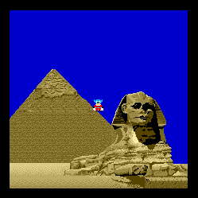
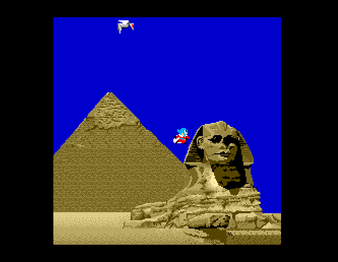

## Amiga OCS sprites

If you want to create a platform game or simply animate a screen, the Amiga's hardware sprites, although limited, should be considered first, generally before bobs (BLitter OBjectS) because of their modest resource consumption.

### Jack strikes back

The small code examples presented here will put sprites to good use through a brief reworking of an arcade classic: Bomb jack.


The arcade version of this game was recently given an excellent Amiga 500 conversion. The point here is not to make a complete new port. But Bombjack happens to lend itself very well to an example of the use of sprites. What's more (and perhaps more importantly) I like this game. In particular, I really like the Amstrad CPC version, which I've played a lot and which I even preferred at the time to the arcade, which I thought was less handy and, of course, more expensive.
I even had it as an original (amazing, isn't it?) in the hit pak vol 1 compilation, which I've kept.

Back to the point, Bombjack (arcade) is a good example of a fixed-screen platform game that takes advantage of the Amiga's sprites, and illustrates what can be done with Amos on the subject.

### Sprite characteristics

The Amiga's hardware supports eight sprites, which Amos handles correctly. 
Sprites are limited to 16 pixels wide, can be as high as the screen and have a palette of 3 colors + 1 transparent color.

The palette distribution is a little unusual:
sprite 0 and 1: colors 16 to 19
sprite 2 and 3: colors 20 to 23
sprites 4 and 5: colors 24 to 27
sprite 6 and 7: colors 28 to 31

So if you're using a 16-color screen, you'll have 16 dedicated colors, indexed from 16 to 31 for sprites. Great! 
If you're using a 32-color screen, the 16 to 31 color palette will be shared between bitmap screen graphics and sprites.

It is possible to combine 2 by 2 (0 and 1 or 2 and 3 etc.) into a single sprite, which can then use all 16 colors, but always with a maximum width of 16 pixels. If you go beyond 16 pixels, additional sprites (or pair if you use 16 colors) will be consumed. Simple 4-color sprites and 16-color sprites can coexist as long as sprites are available.
Many arcade games use 16-color sprites for the main character like Turrican : 16 colors sprite in a 16 color screen :


In addition to the palette, one advantage of sprites is that they are drawn by the hardware on the background without altering it. So there's no need to manage the saving of the underlying scenery.

Jack arcade is 16 pixels wide and has less than 16 colors. He's the perfect candidate for a 16-color sprite. 
We'll therefore use sprites 0 and 1 combined.

### Amos and sprites

To display sprites with Amos, simply load or create a sprite bank and use the SPRITE command. Easy :-)
The sprite bank is as follows. It comes from the arcade version.


Here's an example of how to use the Sprite command once the bank is loaded:

```
Sprite 0,120,100,1
```

This means that we want to use hard sprite 0, position it at (120,100) and use graphic image 1 from the sprite bank in memory:
- The sprite identifier here 0 therefore corresponds to hard sprite 0. The identifiers from 0 to 7 are used to specify the hard sprites to be used (if they are free). If the index is greater than 7, this tells amos that our sprite is a calculated sprite, a combination of hardware sprites available in the display area. This allows us to conditionally exceed the number 8 of sprites on the screen. We won't go into detail here.
- 120,100 are the x and y coordinates, but they are not screen coordinates but hardware coordinates. To convert screen coordinates to hardware coordinates, use the "x hard()" and "y hard()" functions.
- 1 is the index in the sprite bank, which is bank 1. Bank 2 is used for icons. If the image of the sprite is in 16 colors and occupies a maximum of 16 pixels, which is the case in the program, 2 sprites are consumed (0 and 1). Sprite 1 is therefore no longer available.

Program 1 'displayASprite.amos' has commented sources. It loads two banks: the sprite bank containing jack and an icon bank containing the scenery to liven things up. The sprite is displayed in the middle of the background.



### Amos' built-in animation language

A rather quick way of using sprites is to integrate them into a loop and at each iteration modify the image or position:

```
For X=0 To 100
   Sprite 1,X,100,1
   Wait Vbl 
Next 
```

In fact, it's best not to do this, as Amos initializes a sprite when it encounters the 'Sprite' command (true also with 'Bob')
So a generally preferable practice is to initialize a sprite and then, in the program's main loop, modify the coordinates using AMOS's animation language, AMAL.

AMAL has a specific instruction set, which is a simplified subset of Basic (in the spirit of Amos), variables called 'registers', and allows you to define jump labels.
Instructions are written in a character string and associated with an animation channel linked to the sprite. There are 16 animation channels automatically managed by interrupt. A mode not shown here allows you to go beyond 16 channels.

```
Rem An AMAL anim string
A$="S: M 100,50,50; M -100,-50,50; J S"
```

AMAL has an Anim instruction (abbreviated to A) for image sequencing, a Move instruction (M) for moving an object (in this case, a sprite), a Let instruction for assigning a value to a register, a conditioned jump and loop instruction...
The aim here is not to give an exhaustive presentation of Amal. The language is well documented in a dedicated chapter of the Amos or Amos pro manual, easily found on the Internet.

Program 2 'displayASpriteWithAnimation.amos' moves the sprite horizontally back and forth using AMAL via the Move instruction. You can see how to assign an AMAL animation channel to a sprite and how to write a set of instructions.

### Interaction between the main program and Amal

The management of an object like Jack is based, on the one hand, on calculations made in a main loop like joystick reading, state change management (walk, jump...), collision management... and, on the other hand, on an Amal program that handles the sprite's position and the image to be displayed.
Special registers called external registers enable communication between Amos and Amal.
These 26 external registers are represented by the Amreg() table. So Amreg(0) is the first register, Amreg(1) the second and Amreg(25) the last. Each register can therefore be associated with a letter of the alphabet.
In Amal, Amreg(0) corresponds to RA, Amreg(1) to RB and Amreg(25) to RZ.

Note: Amal can even perform some processing directly, such as collision detection or joystick/mouse reading. So, depending on the context, the main program and Amal may be split between them.

### Amos Jack

The main program 'jack.amos' implements Joystick control of Jack's movements.
Some of Jack's movements are taken from the arcade version. Here's the implemented behavior taken from the original game:
- On the ground, left and right joysticks allow Jack to walk within the limits of the scenery.
- On the ground, the fire button triggers a jump. The height of the jump is limited (1/2 of the screen here), after which the character falls back down.
- In the air, left and right allow Jack to fly within the limits of the scenery.
- In the air, pressing fire interrupts the jump and allows Jack to fall back down. In the event of a fall, the fire button brakes the fall.

In the main program, the state (running, jumping, falling, stationary) and its change are managed in the main loop. The speed of movement is calculated according to the states. All this is transmitted to the Amal chain via Amreg() registers.
I also added the fly robot (sprites 2 and 3) to liven things up a bit. 
The result is as follows:



In the real game, up direction allows to fly higher. It is not implemented here but it won't be difficult. It can be an interesting exercise.

If we execute the source, even without compilation, we can see that movements are smooth (50 fps). Only 4 hardware sprites are used on a scenery with its own palette.
The remaining 4 sprites could be used for the bonuses that appear or the animation of bombs picked up. 

### It can be optimized (of course!)

With this code, which has been designed with readability in mind, a great deal of optimization is possible: 
- joystick reading can be done with a single instruction instead of several instructions per movement,
- branches and tests in the main loop can be improved.
- The scenery is only 224x224, whereas a 320x256 screen has been defined.

But that's all for this sprite snippet. I think in a future snippet I will use this base of code to speeak about bobs.


