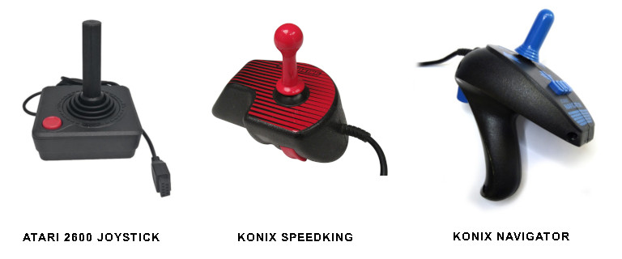
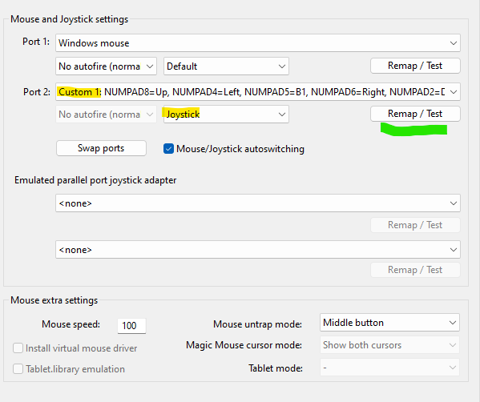
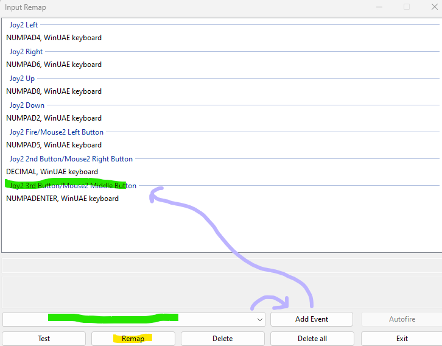
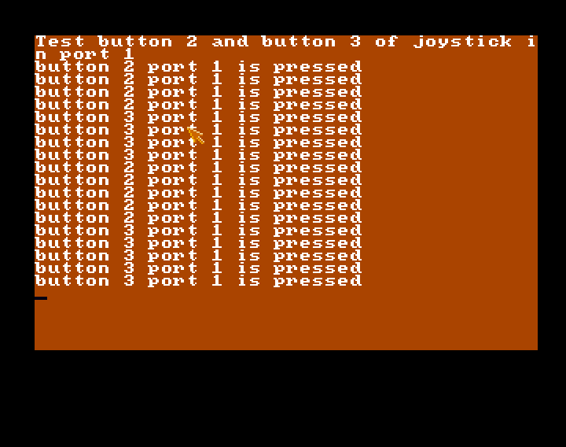

## Introduction

Most of the Amiga's historic joysticks have only one button.



It's a pity, because the Amiga has natively been able to manage three buttons since the first models.

The idea of this post is to read these additional buttons in Amos. In fact, it's an opportunity to see how to write or read the Amiga's hardware registers.

This snippet was inspired by a Photon / Scoopex article available here : http://coppershade.org/articles/More!/Topics/Support_3_Buttons_in_Amiga_Games!/
Thanks to him.

## Reading and writing hardware registers

The Amiga's marvelous capabilities can be accessed by manipulating registers. Many documentations on the Web present them. For example, the following resource :
http://amigadev.elowar.com/read/ADCD_2.1/Hardware_Manual_guide/node0060.html

these registers are addresses of words (16 bits) corresponding to a certain chip memory area.

To read from or write to memory, Amos provides the following instructions: 
- Peek and Poke to read or write a byte (8 bits)
- Deek and Doke to read or write a word (16 bits)
- Leek and Loke to read or write a long word (32 bits).

So Deek and Doke are the instructions to be used to read or write a given register.

Registers are either read-only or write-only. You must therefore be careful not to write to a read-only register or read a write register, as this may result in a machine reset...

For example, the CLXDAT register ($DFF00E) is used to find out if there is a collision between pairs of hardware sprites or between a pair of sprites and a playfield in the sense of the dual playfied mode, i.e. the 3 even biplanes or the 3 odd bitplanes.
To read this register in amos, you need to use Deek :

```
CLXDAT = Deek($DFF00E)
```

Perhaps one day we will do a post about CLXDAT but let's come back to the joystick buttons read.

## Reading three joystick buttons

### Overview

There are several registers to indicate the status of one of the two joysticks. Two joysticks are of course managed: the one possibly connected to port 0 (usually occupied by the mouse) and the one connected to port 1, which is the usual port for that.

The registers are as follows:
- JOY0DAT read ($DFF00A): joystick directions 0 (also for the mouse)
- JOY1DAT read ($DFF00C): joystick directions 1 (also for the mouse) 
- CIAAPRA playback ($BFE001): for standard fire button on both joysticks
- POTGOR read ($DFF016): for buttons 2 and 3 on both joysticks
- POTGO write ($DFF034): works with POTGOR (see below)

There are other registers for other controllers, and some of the above registers also have additional roles that are not all controller-related.

Amos already provides instructions that exploit JOY0DAT, JOY1DAT and CIAAPRA to manage the horizontal and vertical movements of joysticks and classic 'fire' buttons.
These instructions are Jleft, Jright, Jup, Jdown, Fire and Joy.

However, there is no native AMOS management of buttons 2 and 3, and that's what we're going to do here by exploiting the POTGO and POTGOR registers.

### POTGO et POTGOR

The POTGO and POTGOR registers can be used to manage a wide variety of controllers and the two additional buttons.

To manage the two buttons, you need to set the some bits to 1 at address POTGO and read some of these bits at address POTGOR at least 300 microseconds later.
In concrete terms, this means writing $FF00 to address $DFF034 (POTGO) and reading certain bits at address $DFF016 (POTGOR) with a slight delay.

The POTGOR bits to be read are as follows:
- bits 8 = 0 means that button 3 of joystick port 0 (usually the second player) is pressed   
- bits 10 = 0 means that button 2 of joystick port 0 (usually the second player) is pressed    
- bits 12 = 0 means that button 3 of joystick port 1 is pressed
- bits 14 = 0 means that button 2 of joystick port 1 is pressed 

Note that the bits are set to zero when the button is pressed.

To manage the 300 microsecond delay, the simple practice is to initialize POTGO before the main loop and, in the main loop after reading POTGOR, write $ff00 back into POTGO before the vbl.

In concrete terms, here's the code for reading buttons 2 and 3 on joystick port 1 (player 1):

```
Doke POTGO,$FF00
STICK=0
Wait Vbl 
Repeat 
   STICK=Deek(POTGOR)
   
   ' Test bit 14
   If(STICK and 16384)=0 Then Print "button 2 port 1 is pressed"
   ' Test bit 12
   If(STICK and 4096)=0 Then Print "button 3 port 1 is pressed"

   ' mask POTGO 
   Doke POTGO,$FF00

   Wait Vbl 
Until Mouse Key=1
```

Using a logic And, you can simply test bit 14 (2 power 14 = 16384) and bit 12.
Amos also offers the Btst function for this purpose.

### Set up Winuae for testing

Winuae can be configured to use all three buttons.
By default (Winuae 5.2.0), the configured joystick has a second button accessible by the "Del, decimal" key at the bottom right of the keyboard.

To set up three buttons, you need to define a Custom Joystick controller:



Next, click on the green button above to configure the keys, which gives access to the following screen:


To add a third button, select an event from the green underlined combo box.

From here, you can test the code by clicking on buttons 2 and 3.


