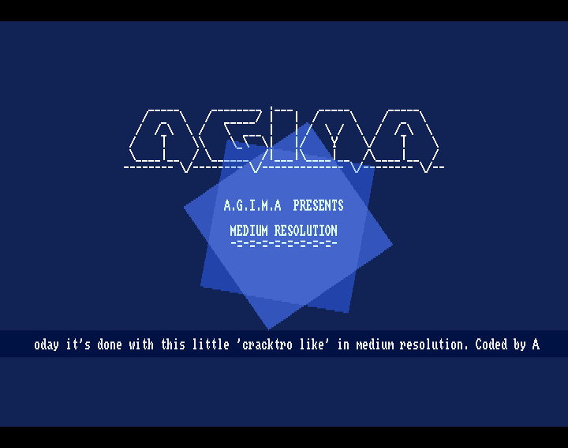
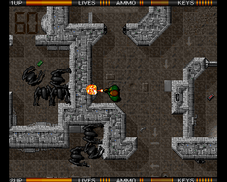

## Introduction

Let's code a small kind of cracktro. This is in medium resolution (640x256), which is a feature of the Amiga that we haven't used until now.

The code in this little production is commented and uses elements that have been presented in previous snippets.
This post will therefore only focus on the original points.

But first, here's what it looks like:



A video is available here: https://youtu.be/yH8yDvl_kDQ

The music is a classic chiptune composed by Mantronix / Fairlight (thanks to him).

## Medium resolution

To open a screen in medium resolution, use the hires parameter (value is $8000) when opening a screen :
```
' Open a 640x250 8 colors screen number 0 in medium resolution
Screen Open 0,640,256,8,$8000
```

On the Amiga, up to 16 colours can be displayed in medium resolution. Dual playfield is also available, but limited to two planes of 4 colours.
On the whole, although Amiga medium resolution offers much greater finesse, its performance is much lower than that of low resolution.
Of course this is obviously even truer with Amos.

## Ascii logo and font

The logo has been generated with one of the numerous online web tools :

```
    _____     ________ .___    _____      ___
   /  _  \   /  _____/ |   |  /     \    /  _  \
  /  /_\  \ /   \  ___ |   | /  \ /  \  /  /_\  \
 /    |    \\    \_\  \|   |/    Y    \/    |    \
 \____|__  / \______  /|___|\____|__  /\____|__  /
-------- \/-------- \/------------- \/-------- \/--
```

The default font is topaz. Apart from the music, no assets have been used in this intro. Topaz is used to create the graphic font in the form of a bank of icons for scrolling text. A prettier graphic font could of course be used.


## Horizontal scroll text

To create a scrolling text, the algorithm shown in snippet 6 is not used because it's not possible to open a screen wider than 1024 pixels. 
However, the algorithm is based on a screen twice the horizontal size. So 640x2=1280 pixels would be required.

The technique used is less efficient overall, but is sufficient here to maintain scrolling at 50 fps.
It simply consists of moving the text scroll area by n pixels per iteration using the 'Screen Copy' command (this command uses the blitter):
```
' Simple left offset of 1 pixel with the blitter (screen copy) 
   Add DROP,1
   DROP=DROP and 7
   If DROP=0
      IC=Peek(S+ITXT)
      Add ITXT,1,0 To L
      Screen 1 : Paste Icon 640,4,IC : Screen 0
   End If 
   Screen Copy 1,1,3,648,12 To 1,0,3
```
Every 8 scroll iterations, a letter is copied to the invisible right-hand side of the screen.
Determination of the letter is based on an algorithm similar to that presented in snippet 6.

## System deactivation

When a program is running, a small proportion of machine resources are consumed by external processing managed by the system.
It is possible to deactivate this by calling an Exec function, which saves 5 to 10% of power:
```
' Disable system 
F=Execall(-132) 
```

Please note that the floppy drive, keyboard and mouse are inaccessible with the classic Amos functions that pass through the OS. And you won't be able to use the usual <control C> to quit the program.

To reactivate processing, execute :
```
' enable system
F=Execall(-138) 
```

To manage the mouse buttons, in the case of deactivation, 'Mouse Key' no longer works. A direct hardware read is therefore made from the $BFE001 register, testing bit 6, which corresponds to the click of the left mouse button :
```
' Value of -1 if no left button is clicked,0 otherwise
If Btst(6,$BFE001)=0 Then Exit 
```

## Rotating squares

To make the cracktro look cool, two squares rotate in the background in two separate bitplanes. 

Nothing special from a vector point of view compared to previous snippets. 
However, we can note that the animation of the squares is in 25 fps while the rest of the demo (like the scroll text) is in 50 fps. The code shows how to do that in Amos.
It can be applied to bobs (in 25 fps) while sprites are in 50 fps.

Many demos and games use this technique in order to have smooth scrolling and sprites in 50 fps and bobs in 25. For example the excellent Alien Breed / Team 17 1991 uses this technique:




## Final words

Once compiled and compressed (with the music included), we obtain a small, smooth cracktro in medium resolution weighing 43 KB. 
Not bad for a basic :-).
The result is in the adf present with the sources.


