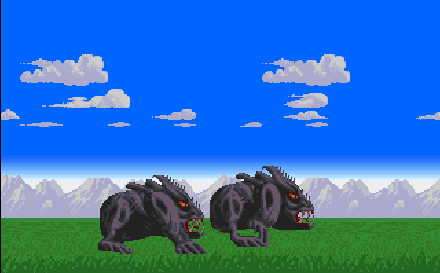
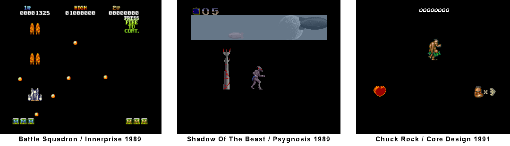
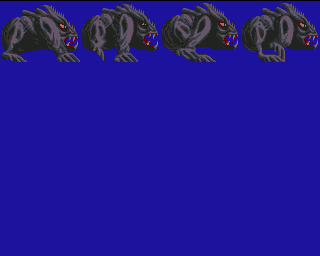
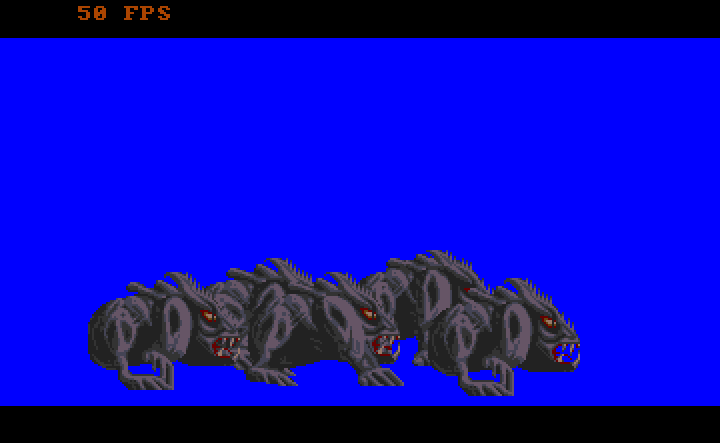

## Introduction

A primary cause of slow rendering in Amos is the improper use of bobs, i.e. the Amos ‘BOB’ instruction.

The objective is to display a scene showing fantastic animals running across a plain decorated with mountains. These animals are bobs:



You can see a video here : https://www.youtube.com/watch?v=E95lhGj84lc

This relatively simple example will help us identify a few guidelines for using bobs effectively.

Note: Amiga specialists will recognise the ‘bison’ from Shadow of the Beast III / Psygnosis 1993, as well as the mountains and clouds.
The grassy ground is borrowed from a game that has been in development for many years (and may unfortunately have been abandoned): Eon.

## Reminder about Bobs

Bobs are rendered by the Amiga component called Blitter. BOB simply stands for Blitter OBject.
Bobs are directly linked to video memory and therefore to bitplanes. They are rectangular areas copied and transformed by the blitter.

## Use sprites first

Before using bobs, it is advisable to use sprites as much as possible. Sprites are managed by a different hardware component than the Blitter and have certain limitations, but they are not very resource-intensive.

Most games that make proper use of the Amiga's hardware make extensive use of sprites.
Here are three examples of games for which only the copper and sprites are enabled (bitplanes and therefore the blitter output are disabled):



The main characters in a game and the scoreboard are often rendered using sprites.
Many games go further with scenery elements or other removable objects rendered using sprites, as can be seen here with Battle Squadron / Innerprise 1989 or Shadow of the Beast / Psygnosis 1989.

So always try to render as many things as possible using sprites.

## Be mindful of the size of bob frames

One obvious thing to note about bob size is that you should try to use the smallest bobs possible with the smallest possible bitplane depth (in this case, 8 colours,
so 3 bitplanes).

Furthermore, and this is less obvious, the horizontal dimension of a bob is always a multiple of 16. So a frame with a width of 13, 14 or 16 pixels will be associated with a bob with a width of 16 pixels. It is therefore advisable to be precise when creating frames.
For example, if you create a frame with a width of 33 pixels, the bob will actually be 48 pixels wide (3*16). In this case, it would be better to reduce the frames to 32 pixels so that the bob is actually only 32 pixels wide.

## Creating a bobs bank

Amos manages data called "bank". Bank 1 is the one we are interested in because it contains the frames of the bobs (or sprites) to be displayed.
Such a bank, in "abk" format, can be loaded from the disk or included in the .amos source (amos files are not plain text).

The `**makeAssets.amo(s)** program shows how to create a bank from an IFF image using the ```Get Bob``` command and save it to disk.
This IFF image contains the four frames that we want to animate:



The program **makeAssets.amo(s)** opens an 8-colour low-resolution screen, loads this IFF image and cuts out 4 frames.

Note that the command :
```Get Bob i,X1,Y1 to X2,Y2```
will cut out frame i in the rectangle with coordinates top left (X1,Y1) and bottom right (X2-1,y2-1).

## Using the BOB instruction

The Amos BOB instruction is used to initialise and display a Bob, i.e. a rectangular image from a Bob bank that uses the palette, resolution and colour depth of the screen on which it is rendered.

For example:
```
Bob 0,100,100,2
```
Initialises and displays a bob with id 0 at position 100,100 on the current screen. The frame displayed is the image number 2 from the sprite/bob bank (bank number 1).

Amos takes care (with the Blitter) of restoring the background under the bob when it changes (movement, image change, etc.).
An animation language called AMAL is used to manipulate bobs.
The online documentation on bobs is available here : https://amospromanual.dev/07-02-blitter-objects.html ans then AMAL documenation is here : https://amospromanual.dev/07-06-amal.html

It is important to note that the Bob instruction initialises the bob. Therefore, this instruction should NOT be used in an animation loop. To animate a bob, the AMAL sublanguage must be used.

**I think this is the main reason why Amos bobs are rendered so slowly in some codes!**

## Animation of a few bobs

The program **SimpleBobs.amo(s)** animates bobs based on the frames obtained in the previous paragraph. 
Note that the ```Bob``` instruction is only used at the start of the programme and that all animation is done with AMAL.

Here is an example of the initialisation of a bob (the one with Id 3) taken from this programme:
```
Bob 3,190,135,1
Channel 3 To Bob 3
Amal 3,"A 0,(4,6)(1,5)(2,6)(3,6); S: M 0,0,200; M 20,0,20; M 0,0,100; M -80,0,20; M 0,0,150; J S"
Amal on
```
Bob with id 3 is initialised, then an animation chain is created with Amal: frames 4, 1, 2 and 3 are displayed successively every 6 or 5 50ths of a second and Bob is moved cyclically horizontally.

It should be noted that to achieve flawless animation rendering, double buffering is enabled, which instructs Amos to render to a logical screen and then swap this screen with the physical screen at each VBL.
This is a classic technique that I believe I have already mentioned in previous snippets.

## Optimising Bobs with Set Bob

It is interesting to know how many bisons can be animated.
Without any particular optimisation, three 80x60 bobs can be animated at 50 fps on a 320 x 200 screen with 8 colours. It is almost possible to animate a fourth, but there are some slight slowdowns.

That's not bad, but we can easily do better. In fact, in the SimpleBobs.amo(s) programme, there is no background under the bison. We can therefore disable background restoration with the ```Set Bob``` command.
We can do other things with this command.

Once disabled, we can easily animate 5 large bobs in an 8-colour screen on a standard Amiga 500. The Amiga can do better using Assembler, but not bad for a BASIC!

Here is the result obtained by **SimpleBobs.amo(s)** :



## Final program with scrolling

The main code in this example, **bobsWithBeast.amo(s)**, incorporates everything covered in the previous paragraphs and adds scrolling with a background.

To ensure that the background under the bison remains empty for optimal performance, we use the Amiga's Dual Playfield mode.
We therefore have two superimposed screens, each with eight colours:
- the background contains the scenery. The scrolling technique and dual playfield mode used here have already been covered in snippets 2 and 3 (https://github.com/alain-treesong/amiga_coding_in_amos/tree/main/snippet-003_simpleDualPlayfield)
- the foreground contains the bisons so there is no scenery to restore and we can use the Set Bob optim seen before

To ensure 50 fps without additional optimisation, I limited the scene to 2 bison, but 3 would probably be possible at 50 fps and even more by disabling the copper list and taking charge of the raster and scrolling (see snippet https://github.com/alain-treesong/amiga_coding_in_amos/tree/main/snippet-011_copperProgramming).

## Going further

Of course, there is still room for optimisation, and Amos offers other possibilities for managing bobs:
- You can manage the bob rendering cycle yourself with ```Bob Update Off```
- Collisions are supported, and you can enable/disable collision masks (enabled by default)
- You can manage the copper list yourself as said before, allowing you to introduce differential scrollings.

That's all folks for today.

