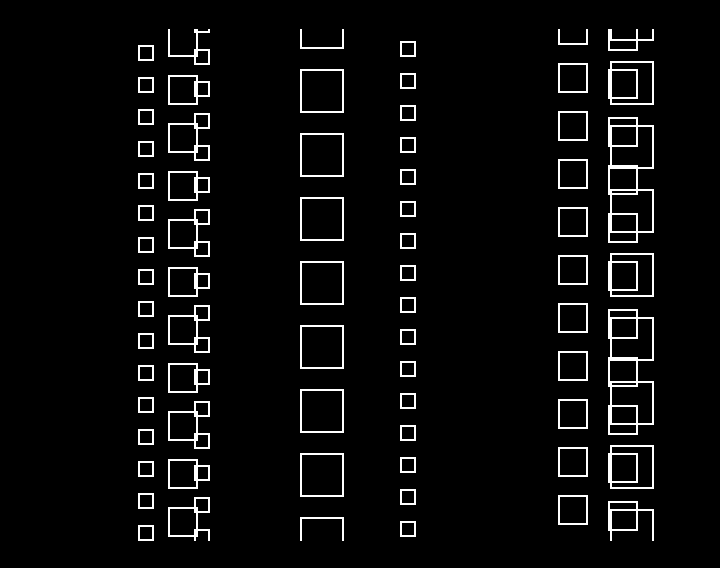
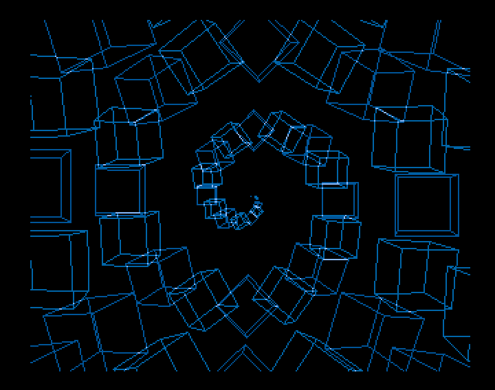

## Introduction

The "Unlimited BOBS" or "Infinite BOBs" is a classic demo-scene trick for displaying an unlimited number (apparently) of Blitter Objects (BOBs), i.e. a large number of animated graphical objects.
It is a trick based on constructing a finite set of images that are displayed cyclically.

Here is a classic example of this effect in the "Unlimited Bobs" demo by Sidon, 1990 (https://demozoo.org/productions/228894/):


Here, it looks as though dozens of red balls are moving around. In reality, it is an animation composed of several screens whose graphical content is built up progressively through a cyclic sequence of images.
Only a single BOB is actually drawn on each frame.

To explain the principle in more detail, let's take a simple example consisting of three images that are displayed one after another.
In the first image, we draw a BOB represented by "+". In the next image, the same BOB is shifted horizontally by a few pixels, and we continue shifting it in the third image. The three images are then displayed one after another.
This gives us something like:
```
Image 1: [ +          ]
Image 2: [  +         ]
Image 3: [   +        ]
```

So, if we display the three images successively, the viewer sees a + moving slightly to the right.
When we return to image 1, we continue moving and displaying the BOB. Of course, this BOB has already been displayed during the first pass through the image. This gives the impression that two BOBs are moving horizontally.
We do the same thing with the other two images:
```
Image 1: [ +  +       ]
Image 2: [  +  +      ]
Image 3: [   +  +     ]
```

So, displaying the three images in sequence now gives the impression of two BOBs moving to the right. We repeat the process, and at the end of it, it appears as though multiple BOBs are moving horizontally across the screen when the three images are displayed one after another:
```
Image i: [ +  +  +  + ]
```

The "difficulty", therefore, is to construct an image that is compatible with a cycle, and thus contains repetitive elements.
The animation itself can take many different forms and is of course not limited to moving BOBs. For example, it can be a vector animation (potentially also built using the blitter, or by other means).
This effect, combined with vector 3D, has been used in four of Agima's productions so far (all of them, of course, made in AMOS):


## Implementation in AMOS
In AMOS, the simplest implementation is to create an animation based on AMOS screens. Up to 8 screens can be opened in AMOS, each with a maximum of 6 bitplanes.
However, be careful with memory consumption: a 320×256 bitplane requires 10 KB of CHIP RAM. So, 8 screens with 3 bitplanes (8 colours) will consume 240 KB of CHIP RAM!

For example, let's open 8 screens with 2 colours:
```
For I=0 To 7
   Screen Open I,320,256,2,Lowres
   Palette $0,$EEE
   Paper 0 : Cls : Flash Off : Curs Off : Hide 
Next 
Wait Vbl 
```

Let's suppose we want to create a rain of simple squares falling vertically from the top to the bottom of the screen. The final result will not be particularly interesting, but it illustrates the principle nicely.
To do this, let's initialise 8 squares:
```
NDB=7
Dim X(NDB),Y(NDB),SPEED(NDB)
For I=0 To NDB
   X(I)=32+Rnd(256)
   Y(I)=-16
   SPEED(I)=2+(I mod 3)
Next 
```

Each square has a variable size depending on its falling speed, which ranges from 2 to 5 pixels per frame, and a horizontal position ranging from 32 to 288 pixels.
Having 8 squares does not mean that there will only be 8 squares on screen, because the same square will be displayed several times vertically. Indeed, every 8 frames, we return to screen 0, which already contains the current square drawn at a position higher up than its current position.
The drawing of a square stops when it is no longer visible at the bottom of the screen. We then move on to the next square, up to the eighth one.

Here is the loop that draws all the squares:
```
S=-1
Ink 1
For I=0 To NDB
   For J=0 To 255+16 Step SPEED(I)
      Add S,1,0 To 7
      Screen S
      Box X(I),Y(I) To X(I)+7*(SPEED(I)-1),Y(I)+7*(SPEED(I)-1)
      Add Y(I),SPEED(I)
   Next 
Next 
```

In this example, the construction of the animation is not visible to the viewer, since only screen 7 is displayed (the last one opened by `Screen Open`). So we only see the construction taking place on this last screen.
Of course, we can also construct the animation in front of the viewer (much to their amazement :-) ). This is what happens in the demos mentioned above.

To display the final result, the screens are displayed one after another, with a small VBL wait at each iteration:
```
Do 
   Add S,1,0 To 7
   Screen To Front S
   Wait Vbl 
Loop
```

The result, although not particularly spectacular, is as follows. 



The complete commented code can be found in the first example: `firstEx.amo(s)`.


## A slightly more elaborate Scene
The general principle has now been described. The second example is an animation of a cube. A description of a wireframe cube is available in snippet 8:
https://github.com/alain-treesong/amiga_coding_in_amos/tree/main/snippet-008_simpleCube

The idea is to draw, on each frame, a cube rotating around itself while moving towards the viewer along a spiral trajectory.



Hey that's not too bad. I will use it probably in future compo !

The `spiralCubes.amo(s)` source code is fully commented.

You can also find a video showing the result running on a standard Amiga 500 (after compilation) :
https://youtu.be/mGnLXwoc7rY


## Taking It Further

Eight screens is a rather restrictive limitation. It is possible to implement the same principle without thinking in terms of AMOS screens, but rather in terms of groups of bitplanes.
Eight AMOS screens in 16 colours represent a total of 32 bitplanes. These can be grouped in pairs, which would make it possible to double the number of "frames" making up the animation.

That's all folks for today.
