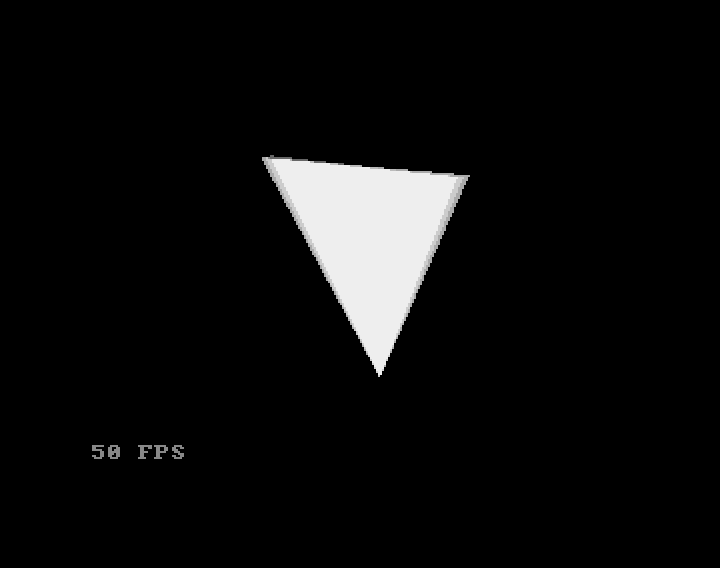

## Vectorial triangle

A simple rotating triangle on the Y axis.
The triangle is drawn on one bitplane.

### Shadow 

Before each new image of the triangle, the drawing of the previous frame is copied with the blitter ("blitter copy") on a second bitplane, itself copied beforehand on a third. By playing with the color palette a shadow effect is obtained. There are other ways to obtain this effect but this is a simple way (an instruction) to do it in AMOS

### Integer arithmetic

There is no mathematical coprocessor on an standard Amiga 500. Numbers with commas go through a software calculation (# notation in AMOS). To obtain 50 FPS, it is necessary to avoid them and therefore all operations are done with integers.

